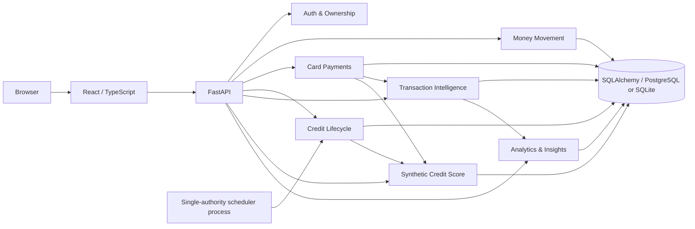

# Aurelia Banking Lab

**A full-stack banking simulator built to demonstrate financial transaction correctness, card-payment flows, transaction intelligence, statement-aware credit logic, and an explainable synthetic credit score.**

[](https://github.com/KirillovD/FastAPI_Banking_APP/actions/workflows/backend-ci.yml)
[](https://github.com/KirillovD/FastAPI_Banking_APP/actions/workflows/frontend-ci.yml)
[](https://github.com/KirillovD/FastAPI_Banking_APP/actions/workflows/container-ci.yml)

> **Portfolio/demo software.** Cards, credit scores, customer insights and banking operations in this repository are synthetic. This is not a real bank, card processor, credit bureau, lending decision system, FICO model or SCHUFA model.

## Demo

The repository is deployment-ready through the included Render Blueprint and Dockerfile.

**Public demo:** add the deployed Render URL here after provisioning.

Default seeded account:

```text
Email: demo@example.com
Password: value configured in DEMO_USER_PASSWORD
Synthetic card PIN: 1234
```

The frontend also supports registering a completely new demo user.

## Why this project exists

The original project started as a FastAPI banking learning application. Portfolio V2 keeps its handwritten banking ideas, then hardens them into a coherent product instead of replacing them with generic architecture.

The result connects several systems that are usually demonstrated separately:

- authenticated bank accounts and ownership rules;
- checking/savings transfers and cash operations;
- synthetic debit/credit cards;
- POS and online merchant-payment simulation;
- MCC-first transaction enrichment;
- German merchant/remittance-description classification;
- daily changing-balance credit interest;
- monthly statements, grace periods and delinquency;
- deterministic credit metrics and score factors;
- customer spending analytics and transparent product suggestions;
- React frontend, CI and Docker deployment.

## Product tour

### Banking dashboard

The React dashboard exposes account balances, IBANs, synthetic cards, recent transactions, 30-day spending and the current synthetic score.

New users can create checking/savings accounts and issue a synthetic credit card without opening Swagger.

### Payment simulator

The merchant terminal supports:

- synthetic card selection;
- merchant name;
- Merchant Category Code (MCC);
- POS + PIN authorization;
- online + CVV authorization;
- credit-limit / available-funds validation;
- transaction persistence and immediate dashboard refresh.

For merchant payments, **MCC is the primary classification signal**. Merchant-name rules are fallback enrichment.

### Transfers

Bank transfers use:

- server-validated source-account ownership;
- recipient IBAN;
- recipient account-holder name;
- positive Decimal amount;
- optional remittance/purpose text.

A normal transfer does **not** receive a fabricated MCC. Its description/remittance text can still be categorized by the existing Germany-oriented rule set.

### Credit Center

The credit subsystem preserves the original project idea:

1. card purchases increase debt;
2. potential interest accrues daily from the changing outstanding balance;
3. interest stays in a pending `acquired_interest` bucket while grace applies;
4. paying the full statement on time preserves grace and waives that pending interest;
5. meeting only the minimum avoids delinquency but loses grace;
6. missing the minimum creates true delinquency / days past due;
7. once grace is lost, earned interest becomes owed rather than silently disappearing.

The frontend exposes:

- limit / available credit;
- utilization;
- outstanding debt;
- pending interest;
- grace state;
- statement balance / minimum / due date;
- on-time and missed-payment metrics;
- current and max DPD;
- repayment flow.

### Explainable synthetic credit score

The score is deterministic and rebuildable from persisted source data.

```text
Baseline 500
   |
   +-- statement payment history
   +-- current / historical delinquency
   +-- aggregate credit utilization
   +-- age of credit history
   +-- rapid limit-depletion events
   +-- small bounded behavioral-spending factor
   |
   v
Synthetic score clamped to 300–850
```

The API/frontend return each factor's point impact and explanation instead of exposing an unexplained integer.

Repayment and delinquency behavior intentionally matter much more than categorized spending.

### Transaction intelligence

Every persisted transaction has a canonical category plus classification provenance.

Merchant/card flow:

```text
Merchant payment
      |
      v
Known MCC? ---- yes ---> canonical category
      |
      no
      v
merchant-name rule
      |
      v
fallback OTHER
```

Transfer flow:

```text
Bank transfer
      |
      v
remittance / description rule
      |
      v
canonical category or OTHER
```

Examples in the synthetic German merchant dataset include REWE, EDEKA, Lidl, Deutsche Bahn, Spotify, Allianz, Trade Republic and others.

### Customer insights

The analytics API reuses the same enriched transaction data to produce:

- rolling spending totals;
- category percentages;
- top merchant/description labels;
- descriptive profile signals;
- risk/stability-category shares;
- deterministic fictional-bank offer suggestions.

The rules are explicit. They do not infer demographics and they do not make lending decisions.

## Architecture



### Request/service boundaries

The API remains a straightforward monolith. Financial coordination lives in services rather than low-level CRUD commits.

```text
router
  -> authentication / ownership dependency
  -> domain service
      -> validation
      -> atomic balance mutation(s)
      -> transaction / statement / metric writes
      -> one coordinated commit
  -> response schema
```

That keeps the project inspectable for a portfolio while still demonstrating service boundaries and financial invariants.

## Financial correctness highlights

Portfolio V2 specifically hardens money movement around:

- Python `Decimal` throughout financial input/business logic;
- maximum two decimal places on externally supplied amounts;
- `Numeric(12, 2)` compatible bounds;
- positive-operation minimum of EUR 0.01;
- rejection of non-finite / oversized monetary values;
- database-expression balance updates rather than stale ORM assignments;
- debit predicates that use the database-current balance and limit;
- atomic transfer debit + credit + transaction persistence;
- rollback on downstream payment/cash failures.

The 10-loop repository review also added regression coverage for stale-session double debit/deposit behavior.

## Security / ownership behavior

- JWT authentication;
- canonicalized email identity;
- bcrypt password hashing with the bcrypt 72-byte constraint enforced at API/hash/login boundaries;
- explicit current-user account/card ownership checks;
- admin dependency;
- server-derived transfer source metadata;
- synthetic card PIN hashing;
- encrypted synthetic CVV with owner-only reveal endpoint;
- expired-card checks;
- other-user card/account IDOR regressions.

The CVV subsystem exists only for the synthetic card issuer demo and should not be read as a production PCI design.

## Technology

### Backend

- Python 3.13+
- FastAPI
- SQLAlchemy 2
- Pydantic v2 / Pydantic Settings
- PostgreSQL via Psycopg or SQLite for local/tests
- bcrypt / PyJWT / cryptography
- APScheduler
- pytest
- Ruff

### Frontend

- React 19
- TypeScript
- Vite
- custom responsive CSS

### Delivery

- GitHub Actions
- multi-stage Docker image
- Render Blueprint
- Neon-compatible PostgreSQL configuration

## API highlights

| Area | Endpoint | Purpose |
| --- | --- | --- |
| Auth | `POST /auth/` | Login / bearer token |
| User | `POST /users/` | Register |
| Accounts | `GET /accounts/` | Current-user accounts |
| Cards | `POST /cards/credit` | Issue synthetic credit card |
| Payments | `POST /payments/` | POS / online merchant simulation |
| Transfers | `POST /transactions/{account_id}` | IBAN transfer |
| Transactions | `GET /transactions/` | Enriched history |
| Credit | `GET /credit-accounts/{id}` | Credit dashboard |
| Credit | `POST /credit-accounts/{id}/payments` | Credit repayment |
| Statements | `GET /credit-accounts/{id}/statements` | Statement history |
| Score | `GET /credit-score/` | Explainable synthetic score |
| Analytics | `GET /analytics/spending-summary` | Category spending |
| Insights | `GET /analytics/customer-insights` | Profile signals / demo offers |
| Operations | `GET /health` | Health check |
| Docs | `GET /docs` | Swagger UI |

## Testing and CI

The current portfolio branch passes:

- **161 pytest tests**
- focused Ruff correctness lint (`E4/E7/E9/F`)
- strict TypeScript production build
- Vite production build
- complete multi-stage Docker build

GitHub Actions workflows:

- `backend-ci.yml`
- `frontend-ci.yml`
- `container-ci.yml`

The test suite includes regressions for:

- ownership / IDOR;
- authentication contracts;
- transfers and cash history;
- payment PIN/CVV authorization;
- precision / money bounds;
- stale-session concurrency;
- credit statements / grace / late cure / DPD;
- scheduler replay/idempotency;
- score movement;
- MCC classification;
- seed data;
- analytics isolation;
- deployment configuration.

## Run locally

### 1. Requirements

- Python 3.13 or 3.14
- Node.js 22
- npm

### 2. Environment

```bash
cp .env.example .env
```

Generate a Fernet key:

```bash
python -c "from cryptography.fernet import Fernet; print(Fernet.generate_key().decode())"
```

Set that value as `ENCRYPTION_KEY` and provide a strong `SECRET_KEY`.

For local SQLite you can omit `DATABASE_URL`.

### 3. Backend

```bash
python -m venv .venv
source .venv/bin/activate
python -m pip install --upgrade pip
python -m pip install -e ".[dev]"
uvicorn main:app --reload
```

Swagger:

```text
http://127.0.0.1:8000/docs
```

### 4. Frontend development

```bash
cd frontend
npm install
npm run dev
```

Vite proxies `/api` to the local FastAPI server.

### 5. Quality gates

```bash
python -m pytest
python -m ruff check .

cd frontend
npm run build
```

## Run the production container

```bash
docker build -t aurelia-banking-lab .
docker run --rm -p 8000:8000 --env-file .env aurelia-banking-lab
```

Open:

```text
http://localhost:8000/
```

The production frontend and API are served from the same origin.

## Demo seed

Set:

```text
SEED_DEMO_DATA=true
DEMO_USER_PASSWORD=<public demo password>
```

Startup creates the synthetic demo user only if it does not already exist.

Seed data includes cash accounts, a credit line/card, statement history, credit metrics, income, German merchant transactions and analytics-ready categories.

## Deployment

See [docs/DEPLOYMENT.md](docs/DEPLOYMENT.md).

The included configuration is designed for one Docker web service plus persistent PostgreSQL.

The web container intentionally does not run the credit scheduler. `scheduler.py` should run as exactly one separate process if continuous scheduled credit jobs are enabled, avoiding duplicate job execution when web instances scale.

## Design and implementation history

Portfolio V2 was implemented in vertical slices, with analysis/decision records retained in `docs/slices/`.

Key documents:

- [Portfolio V2 roadmap](docs/PORTFOLIO_V2_ROADMAP.md)
- [Development workflow](docs/DEVELOPMENT_WORKFLOW.md)
- [Slice 6 — Credit lifecycle](docs/slices/06-credit-lifecycle.md)
- [Slice 7 — Synthetic credit score](docs/slices/07-credit-score.md)
- [Slice 8 — Analytics & customer insights](docs/slices/08-analytics-insights.md)
- [Deployment guide](docs/DEPLOYMENT.md)
- [Portfolio demo walkthrough](docs/PORTFOLIO_DEMO.md)

## Deliberate limitations

This is intentionally a portfolio-sized system, not an attempt to imitate a production bank.

Not included:

- real card-network integration;
- real merchant acquiring / settlement;
- real credit-bureau data;
- real lending approvals;
- microservices / event streaming;
- Kubernetes;
- ML underwriting;
- demographic profiling.

Those omissions are deliberate: the project focuses on correctness, explainability and a coherent client-visible product.
